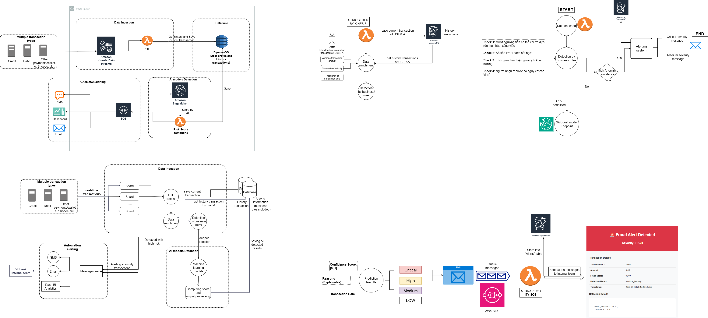
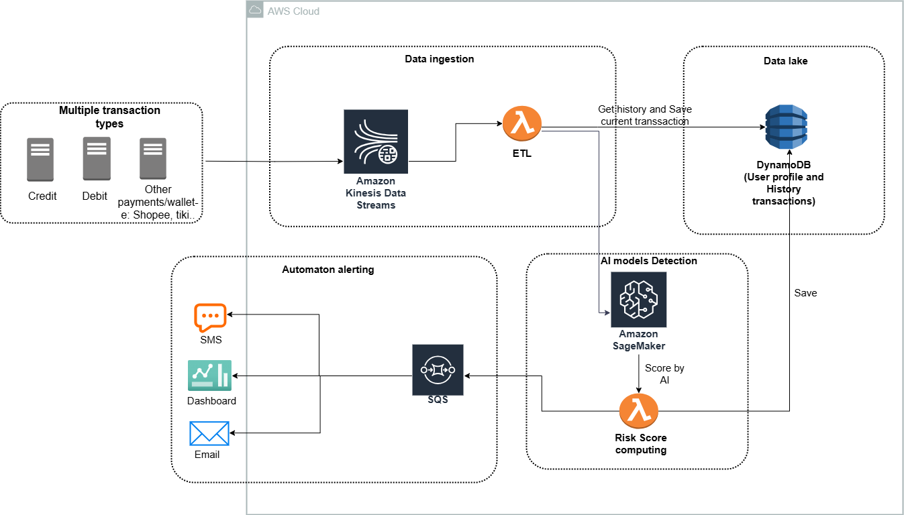
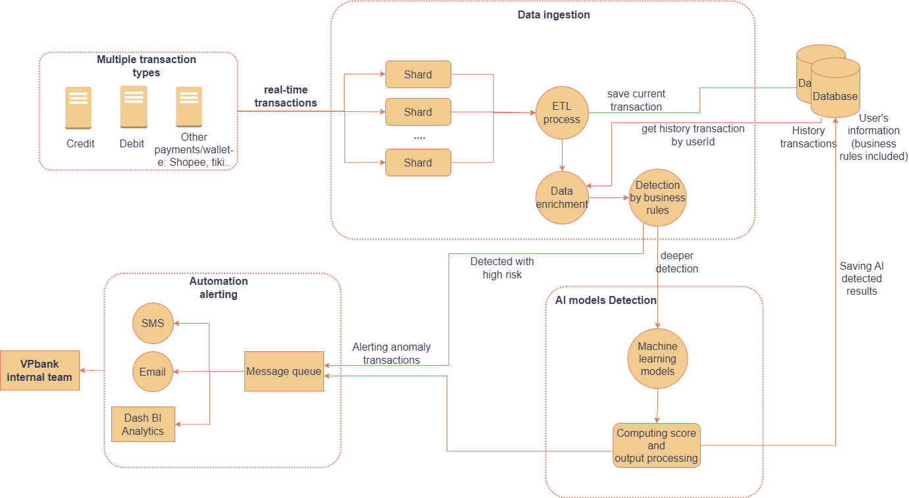

# Fraud Detection BI Dashboard

A business intelligence dashboard built with Streamlit for visualizing fraud detection model predictions and transaction analytics.


## Features
<!-- Insert images form folder images/architecture_diagram -->


- **Real-time Analytics**: Live connection to AWS DynamoDB for real-time fraud detection statistics
- **Geographical Analysis**: State-wise fraud distribution and insights
- **AWS Integration**: Utilizes AWS services for data storage and processing
- **XGboost Model**: Implementing Training jobs and Deployment Endpoint on SageMaker AI Studio

## Demo video
<video width="320" height="240" controls>
  <source src="assets/Demo_Recording.mp4" type="video/mp4">
</video>

## Installation

1. **Install Dependencies**:
   ```bash
   pip install -r requirements.txt
   ```

2. **Required Packages**:
   - streamlit>=1.28.0
   - pandas>=2.0.3
   - numpy>=1.24.3
   - plotly>=5.15.0
   - boto3>=1.28.17
   - sagemaker>=2.176.0

3. **AWS Free Tier Account**:
   - Create an AWS account if you don't have one.
   - Set up AWS credentials in your environment.
   - Requirements for AWS services:
     - SageMaker
     - Kinesis
     - Lambda
     - DynamoDB
     - S3
     - SQS

## Deep Dive into Architecture

